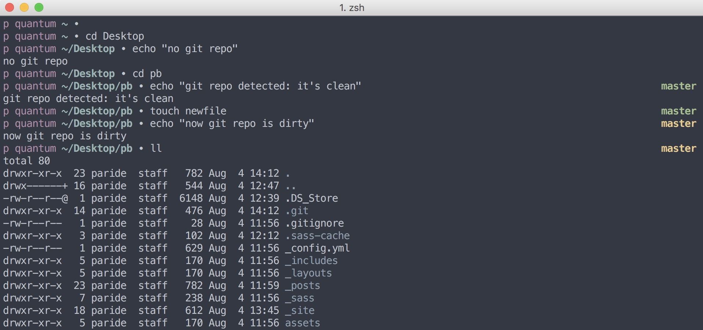

# Focus
A minimal, fast and git-aware zsh prompt for Mac terminal.
It is spartan and efficient: neither plugins nor fancy configurations needed. It just works out of the box.

# Install
Just copy the `zshrc` file into your home directory and rename it to `.zshrc`

# Better with
I usually pair Focus with [iTerm2](https://www.iterm2.com){:target="_blank"} and [Base16](https://github.com/chriskempson/base16){:target="_blank"} Ocean theme (see picture above to have a preview).
